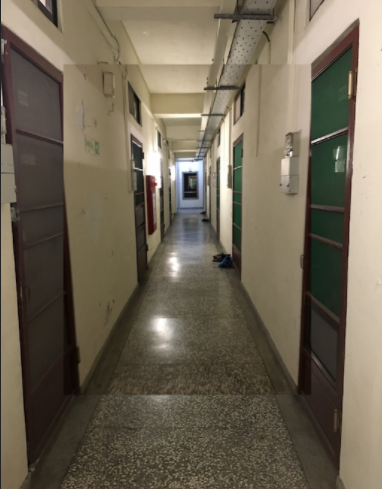

# 2019CVFX_Homework4_Team5

## Sequence of NTHU Campus
#### A. 雅齋宿舍 1 樓走廊

    
    
    
    
    
        

#### B. 雅齋宿舍 2 樓走廊

    
    
    
     

## Feature Extraction and Comparison

#### A. ORB

ORB (Oriented Fast and rotated BRIEF) 是將FAST和BRIEF特徵描述的方式結合起來，並在他們的基礎上做改進跟優化。 
ORB主要是為了拿來取代SIFT和SURF，因為前兩個都有申請專利，無法被免費使用。 
首先，ORB會利用FAST來檢測keypoint，再將所搜尋除來的結果用Harris corner取出前N個最有可能是corner的keypoint。 
為了能夠應對rotation的變化，ORB會對每個keypoint計算weighted centroid，也就是從keypoint到其他weighted centroid的方向。 

優點：速度最快、ORB descriptor的表現比SURF來得更好 

##### scale

	
	

##### rotate

	
	

##### brightness

	
	

#### B. SIFT 

SIFT (scale-invariant feature transform)會針對每個選定的keypoint取周圍16x16個像素點，再切分為4x4的cell。接著，針對每個cell會再進行gradient magnitude和orientation的計算。 
得到16組8 bin 的histograms後，可以再合併為16x8維的資料。最後對這些資料做L2-Normalizing，就可以得到代表那個keypoint的feature vector。  

優點：對尺度具有不變性，即使改變角度、亮度、視角，都能夠得到很好的檢測效果  
缺點：速度慢、產生的資料量大

##### scale

	
	

##### rotate

	
	

##### brightness

	
	

#### C. SURF
上面提到了 SIFT 雖然效果不錯，但是他的速度慢且產生的資料量很大。而 SURF 可以解決這兩個問題。利用 box filter 對 [積分圖](https://zh.wikipedia.org/wiki/%E7%A7%AF%E5%88%86%E5%9B%BE) 進行計算，得出 Hessian matrix。這個方法的好處是，不同大小的 box filter 可以平行計算，加快速度。

優點：速度比 SIFT 快，，資料量較少 
缺點：與 ORB 相比還是比較慢

##### scale

	
	

##### rotate

	
	

##### brightness

	
	

## Image Alignment and Infinite Zooming Effect

### ORB
ORB            |  SIFT
:-------------------------:|:-------------------------:
  |  

## Image Processing

在做image alignment的時候，我們嘗試在邊緣的地方加上羽化的效果，如此一來可以讓視覺效果變得比較柔和，不會有明顯的界線。

	
	

由於上面用 Image Align 做出來的效果實在是差強人意，故我們後來使用 AE 來進行實作以下為我們產生的成果：

## Conclusion

|    name    |  ORB  | SIFT | SURF |
| :--------: |  :--: | :--: | :--: |
|    速度    |  快   |  中  |  慢  |
| ...        |  ...  | ...  |  ... |

## Reference

在 [SIFT,SURF,ORB,FAST,BRISK 特徵提取演算法比較](https://www.itread01.com/content/1546487137.html)這篇文章中有對各種feature extraction演算法進行詳細的比較。 
其中在ORB、SIFT、SURF三項的執行時間上與我們的結論相符合。

