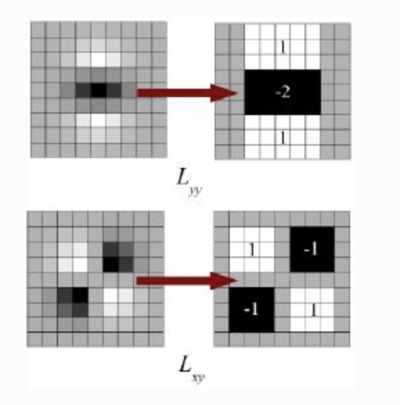
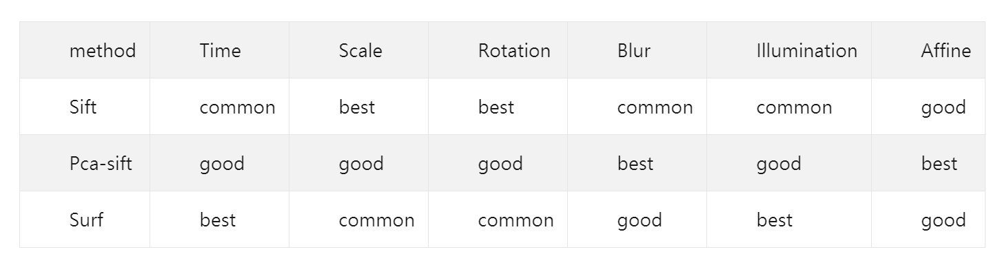

# 2019CVFX_Homework4_Team5

## Sequence of NTHU Campus
#### A. 雅齋宿舍 1 樓走廊

    
    
    
    
    
        

#### B. 雅齋宿舍 2 樓走廊

    
    
    
     

## Feature Extraction and Comparison

#### Introduction

在做影像辨識的時候，能夠提供資訊的特性有edge、corner、blobs等等。像是下圖中 D 圖可以很容易判斷出是兔子眼睛。  
但是像 C 屬於一個沒有變化的局部影像，看不出明顯的特性，就無法明確辨識出屬於圖片中的哪個區域。如果能提取好的keypoint，  
再針對keypoint計算feature就能用來辨識物體。總而言之，影像辨識大致上的步驟可以歸納為  
keypoint detection -> feature extration -> feature matching  

 
 

下面我們會介紹並比較三種較為常見的feature extraction演算法。

#### A. ORB

ORB (Oriented Fast and rotated BRIEF) 是將FAST和BRIEF特徵描述的方式結合起來，並在他們的基礎上做改進跟優化。
首先，ORB會利用FAST來檢測keypoint，再將所搜尋除來的結果用Harris corner取出前N個最有可能是corner的keypoint。
為了能夠應對rotation的變化，ORB會對每個keypoint計算weighted centroid，也就是從keypoint到其他weighted centroid的方向。 

優點：速度最快、ORB descriptor的表現比SURF來得更好 

##### scale

	
	

##### rotate

	
	

##### brightness

	
	

#### B. SIFT 

SIFT (scale-invariant feature transform)會針對每個選定的keypoint取周圍16x16個像素點，再切分為4x4的cell。
接著，針對每個cell會再進行gradient magnitude和orientation的計算。得到16組8 bin 的histograms後，可以再合併為16x8維的資料。
最後對這些資料做L2-Normalizing，就可以得到代表那個keypoint的feature vector。  

優點：對尺度具有不變性，即使改變角度、亮度、視角，都能夠得到很好的檢測效果  
缺點：速度慢、產生的資料量大、不適用於realtime環境

##### scale

	
	

##### rotate

	
	

##### brightness

	
	

#### (補充) Feature Matching: FLANN-Based Matcher
FLANN(Fast Library for Approximate Nearest Neighbors)這裡是先利用SIFT提取keypoints並且計算descriptors，接著FLANN利用KNN演算法進行feature matching。並且會使用ratio test來減少錯誤的feature matching。 

優點：是目前最快的feature matching演算法，能夠減少計算複雜度以及時間，因此也適合應用在feature 較多的場景。 

#### scale

	
	

##### rotate

	
	

##### brightness

	
	

#### C. SURF
SURF (speeded-up robust features)是基於SIFT發展而成的，改善了其速度緩慢的缺點。他常用於偵測corner以及明顯的材質紋路。利用 box filter 對 [積分圖](https://zh.wikipedia.org/wiki/%E7%A7%AF%E5%88%86%E5%9B%BE) 進行計算，得出 Hessian matrix。這個方法的好處是，不同大小的 box filter 可以平行計算，加快速度。

優點：速度比 SIFT 快，資料量較少，可使用於realtime環境 
缺點：速度上仍比不上FAST等keypoint detector

##### scale

	
	

##### rotate

	
	

##### brightness

	
	

## Image Alignment and Infinite Zooming Effect

ORB            |  SIFT           |  FLANN           |  SURF
:-------------------------:|:-------------------------:|:-------------------------:|:-------------------------:
  |  |  |  

我們的作法如下 
1. 將圖片進行放大
2. 放大約 1.15 倍時加入第二張圖，進行 image alignment
3. 重複 1、2

從結果中可以看到，圖片到最後都會壞掉，我們認為這可能是因為在放大與 align 的過程中，可能導致後來貼上的圖片變形，越來越歪。而上一張圖片歪了之後，下一張圖片通常就會變得更歪，導致最後一發不可收拾，直接壞掉。 
另外從 Feature Extraction 產生的結果也可以看出，到後面幾張圖片的時候，產生了許多交叉的線，這些找錯的 feature matching 就是讓圖片扭曲的主要原因。我們嘗試了在很多種放大倍率的情況下加入圖片，但效果都不彰。

除此之外，我們也懷疑可能是圖片的關係導致效果不好，所以我們也利用了 Ａ 圖片產生結果

ORB            |  SIFT+FLANN           
:-------------------------:|:-------------------------:
  |  

這兩個看起來效果還可以，可能是因為 Ａ 圖片的光線比較充足，並且在拍攝的時候拍攝者是每兩步就拍一張照片，距離比較固定，所以在疊圖的過程中比較不會產生很嚴重的扭曲情形。而 Ｂ 圖片在拍攝的時候，每張之間的間距不ㄧ，並且光線也比較有明暗上的差距，這可能是導致扭曲的原因。另外我們覺得，Ｂ 所在的走廊有許多長得一樣的門，這可能導致 feature matching 的時候他 match 到錯的門，這可能也是會導致扭曲的原因之一。
 
 
四種方法之間，就 B 圖片的結果來說， ORB extractor 的效果比較好，圖片的扭曲比較少，其他方法可能是連結到了錯誤的門，導致圖片最後都大扭曲。而 SIFT extractor 在加上 FLANN 之後，效果有變得比較好，比較不會有扭曲的情況，並且他在產生的速度上也比較快 
而 A 圖片看來， SIFT＋FLANN 的結果好像比較優，走廊地面的部分 ORB 看起來歪來歪去的，SIFT+FLANN  在窗戶地方的對齊也做得比較好。 

## Image Processing

在做image alignment的時候，我們嘗試在邊緣的地方加上羽化的效果，如此一來可以讓視覺效果變得比較柔和，不會有明顯的界線。

	
	

由於上面用 Image Align 做出來的效果實在是差強人意，故我們後來使用 AE 來進行實作以下為我們用 B. 雅齋2樓走廊的圖片 產生的成果(點擊圖片可進入 youtube 連結)：

我們的實作方式是參考[這個連結](https://www.youtube.com/watch?v=pOmW76fADz8&t=80s)所做的，對於圖片的邊界也進行了羽化的處理，讓邊界看起來不要那麼明顯。 
利用 AE 做出來的效果比 code 看起來好非常多，如果就一次摸索的人來說，我覺得使用 AE 也比用 code 容易，因為要很好的去 extract 出 feature 並正確的 align 實在太難了。但如果真的寫出來可以做出很好結果的 code，那所花費的時間就可以快上很多。

## Conclusion

|            |  ORB    | SIFT        | SURF |
| :--------: |  :--:   | :--:        | :--: |
|    速度    |  快     |  慢         |  中  |
|    用途    |  ...    | blob、corner| corner、texture|

圖片做出來的效果除了使用不同的 extractor 之外，拍照的環境、手法也會對結果趙城很大的影響。如果想要做出好的結果，則需要在一個光線充足，勁量不要有影子，並且有延伸感（？）並且週外的景物不會差異太大的地方，例如：明亮的長長的走廊，光線充足的草坪等

## Reference

在[A Comparison of SIFT, PCA-SIFT and SURF](https://pdfs.semanticscholar.org/b00c/19f4c596f6b99c34ec6c612adcc61d4e6b53.pdf)這篇論文中
作者對以上三個以算法在經過縮放、旋轉、模糊、亮度等變化之後，與原影像進行匹配，並統計其效果。由上表中可以知道，SIFT在縮放和
旋轉變化的情況下效果最好，而SURF在亮度變化下的匹配效果最好。此外，SURF的速度約是SIFT的3倍。

