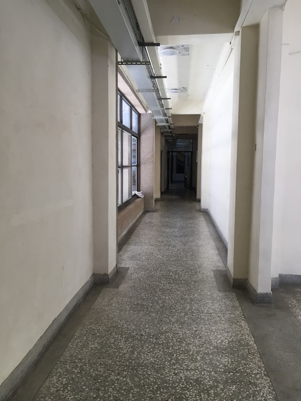

# 2019CVFX_Homework4_Team5

## Sequence of NTHU Campus
#### A. 雅齋宿舍 1 樓走廊

    
    
    
    
    
        

#### B. 雅齋宿舍 2 樓走廊

    
    
    
     

## Feature Extraction and Comparison

#### 1. ORB

ORB (Oriented Fast and rotated BRIEF) 是將FAST和BRIEF特徵描述的方式結合起來，並在他們的基礎上做改進跟優化。 
ORB主要是為了拿來取代SIFT和SURF，因為前兩個都有申請專利，無法被免費使用。 
首先，ORB會利用FAST來檢測keypoint，再將所搜尋除來的結果用Harris corner取出前N個最有可能是corner的keypoint。 
為了能夠應對rotation的變化，ORB會對每個keypoint計算weighted centroid，也就是從keypoint到其他weighted centroid的方向。 

優點：速度最快、ORB descriptor的表現比SURF來得更好 

##### scale

##### rotate

##### brightness

#### 2. SIFT 

SIFT (scale-invariant feature transform)會針對每個選定的keypoint取周圍16x16個像素點，再切分為4x4的cell。接著，針對每個cell會再進行gradient magnitude和orientation的計算。 
得到16組8 bin 的histograms後，可以再合併為16x8維的資料。最後對這些資料做L2-Normalizing，就可以得到代表那個keypoint的feature vector。  

優點：對尺度具有不變性，即使改變角度、亮度、視角，都能夠得到很好的檢測效果  
缺點：速度慢、產生的資料量大

#### 3. SURF

## Image Alignment and Infinite Zooming Effect

