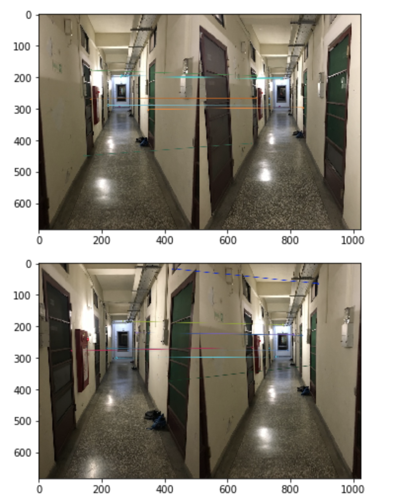

# 2019CVFX_Homework4_Team5

## Sequence of NTHU Campus
#### A. 雅齋宿舍 1 樓走廊

#### B. 雅齋宿舍 2 樓走廊

## Feature Extraction and Comparison

#### A. ORB

#### B. SIFT

#### C. FLANN 

## Image Alignment and Infinite Zooming Effect

